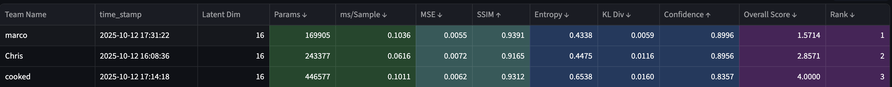

# DL Experimentation

This repo contains the work I did for a week-long competition focused on training **variational autoencoders (VAEs)** on the MNIST dataset and then building **flow-matching models** that could quickly sample from those VAE latent spaces. We were ranked on several metrics, and model size counted against us, so part of this repo reflects choices made to stay competitive on the leaderboard rather than pushing for the largest or most effective architectures.

---

## Overview

The goal was simple:  
1. Train VAEs on MNIST.  
2. Train flow-matching models to generate samples from each VAE’s latent space.
3. Find most effective archtecture to win the competition.

# Note: Although I did get side track for most of the competition because spatial latents where much more fun to play with.
# Second Note: Reason we used MNIST and not CIFAR-10 or CIFAR-100 was because of limited hardware, my spatials would have been much more effective with more scale and challenge.

Although winning was one goal, my other was to compare how different latent designs affected how well and how easily the flow models learned to sample. As this competition helped give us skills to better understand when we added guidance to Stable Audio Open Small (a flow model).

I experimented with both **linear latent dimensions** (e.g., a flat 49-dim latent vector) and **spatial latents** (e.g., a 7×7 latent map). Intrestingly even when the total number of latent parameters matched, the structure mattered a lot as **Flow models had a much easier time generating samples from linear latent spaces than spatial ones.**

I didn’t spend as much time as I would have liked trying to push the spatial versions further, and there are definitely better spatial flow setups out there. But because this was a competition with ranking metrics that penalized large parameter counts (as it was peer ranked and my peers didn't use many high paramter count model), unfortunately I couldn’t use any of the bigger models I spent most of my time training.

---

## Competition Context

This was part of a **week-long leaderboard competition**.  
We were ranked based on several factors, including model size, two metrics regarding VAEs, and three regarding Flow Models. A lot of the class went with smaller models to stay competitive, so I had to keep my architectures within similar limits to avoid dropping in the rankings.

**Leaderboard:**  

Link to [Leaderboard](https://2025-dlaie-leaderboard.streamlit.app/ "Leaderboard for the MNIST VAE + Flow competition")

---
All of the code I used to train models is structured in the files above.
